# TracksApp 

### Mobile app using Express.js API and MongoDB, made in react-native
#### [TracksApp Express.js API repository](https://github.com/Denis-Tojaga/TrackApp_API)

## App startup

#### 1) download the repo from github 
#### 2) go inside that directory in terminal 
#### 3) run "npm install" to download dependencies 
#### 4) to start the app run "npm start"
#### 5) scan the QR code with Camera app on iOS / scan the QR code with Expo Go app on Android / open it on emulator 

 

## App description
- User can <b>signin</b> or <b>signup</b> through a registration form
- Password is hashed with bcrypt and saved with other data in MongoDB 
- On successful signin/signup process user navigates to home screen where he has a clear view of all previous tracks created
- By pressing on certain track, user is navigated to Track details where all details are shown about that specific track
- User can create new track with a title and from that moment his location is followed in order to create new track
- User can also save track in database 
- User can logout and his token will be removed from local device storage, so next time he won't automatically sign in

## Technologies 

- React-native
- MongoDB
- Express.js API
- Ngrok

# App Images

## Android 

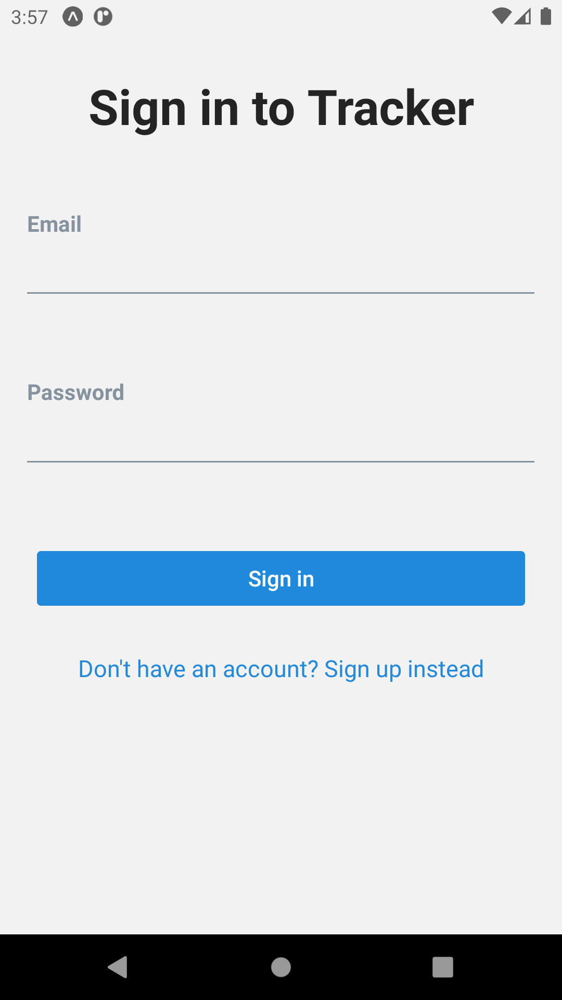  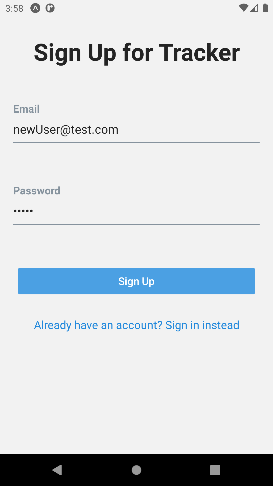
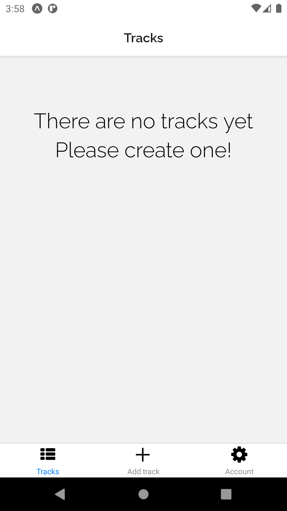  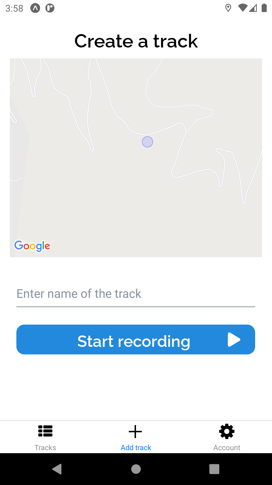    

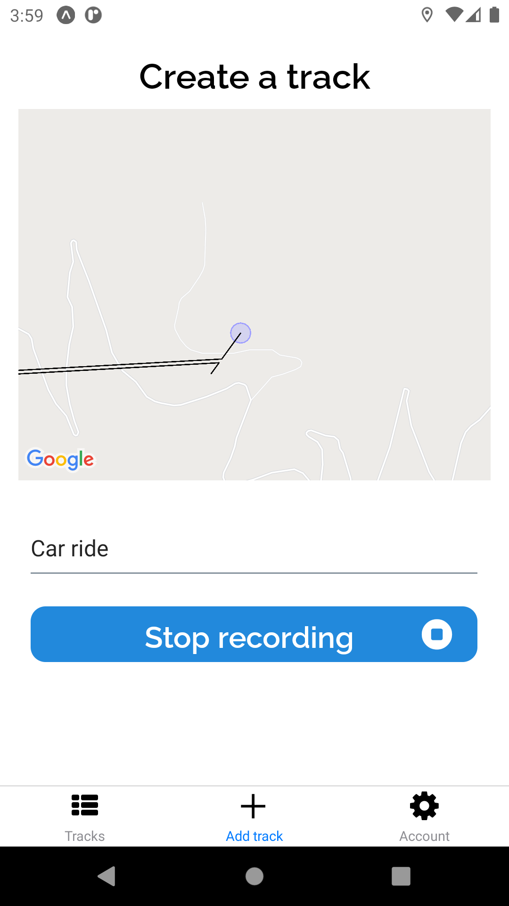  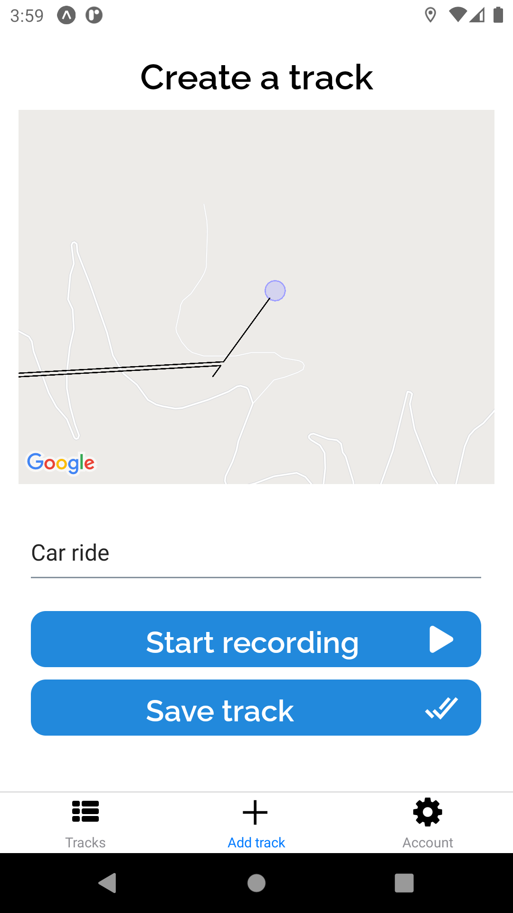    
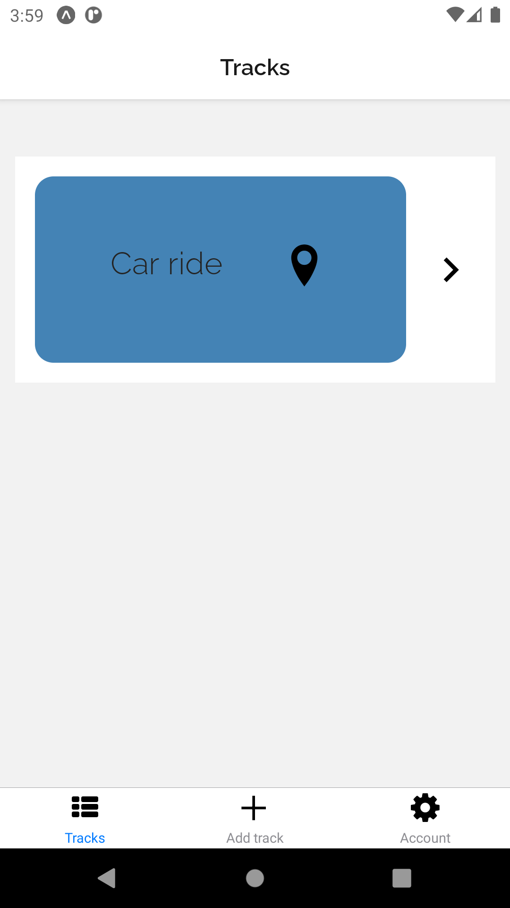  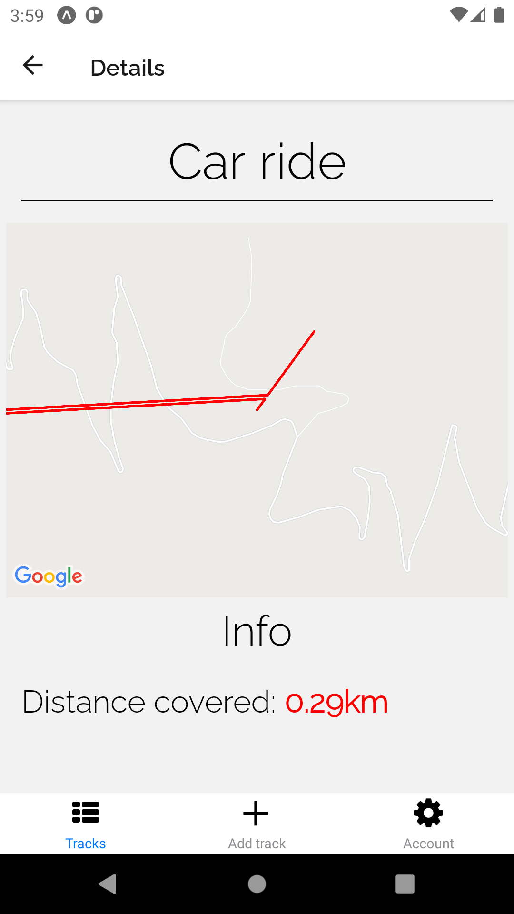  

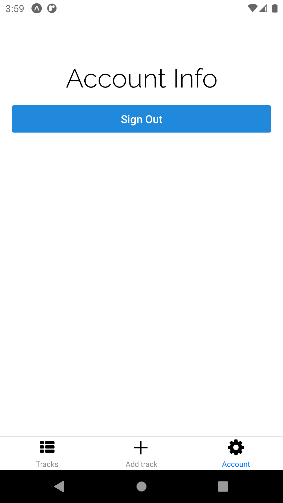  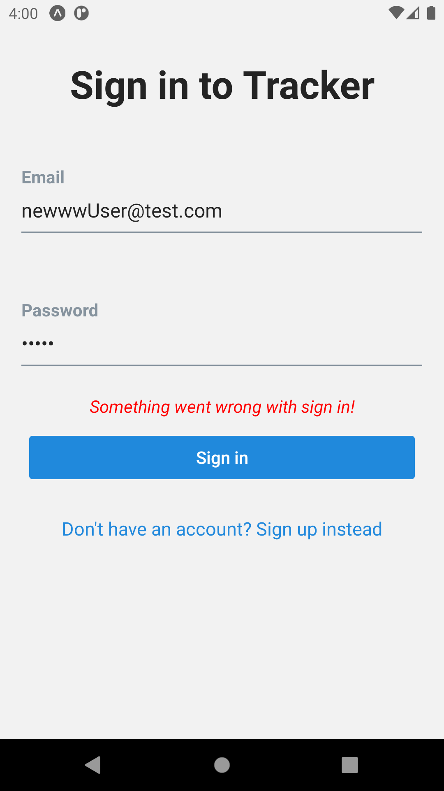   

 

## iOS

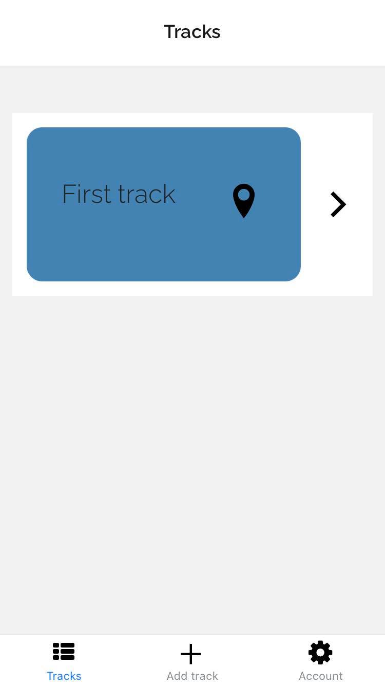  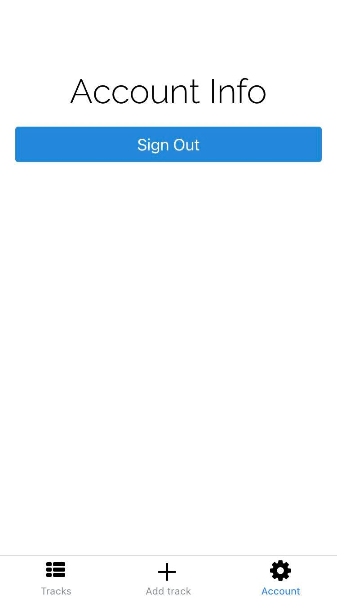
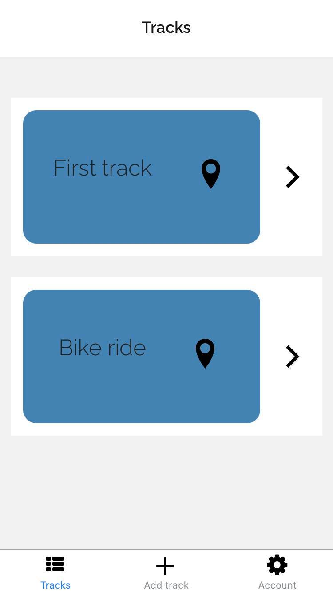  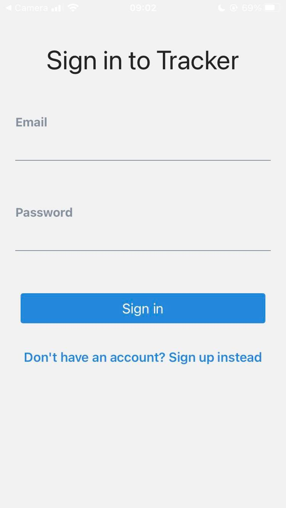    
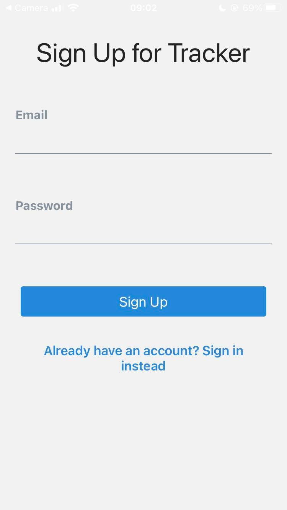  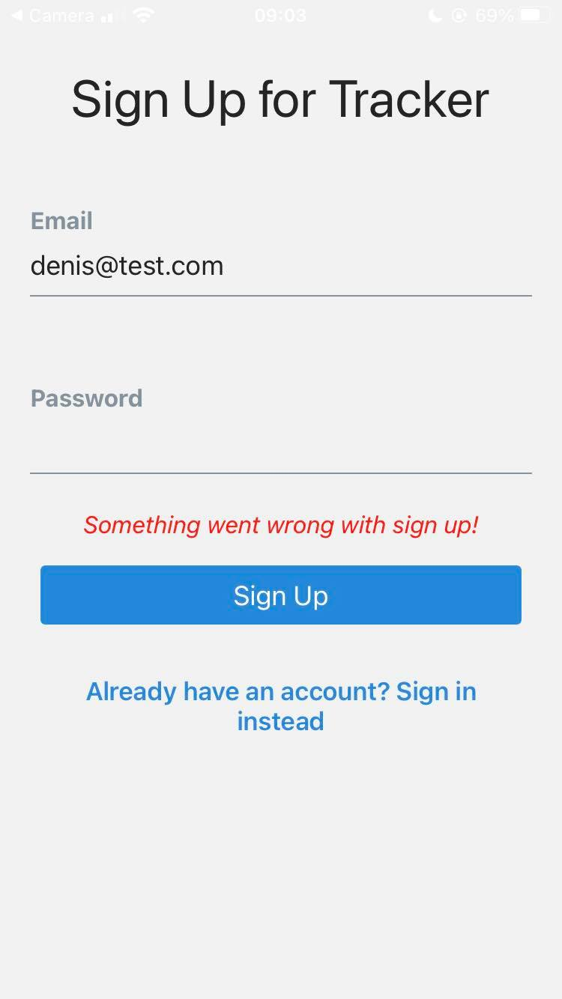    
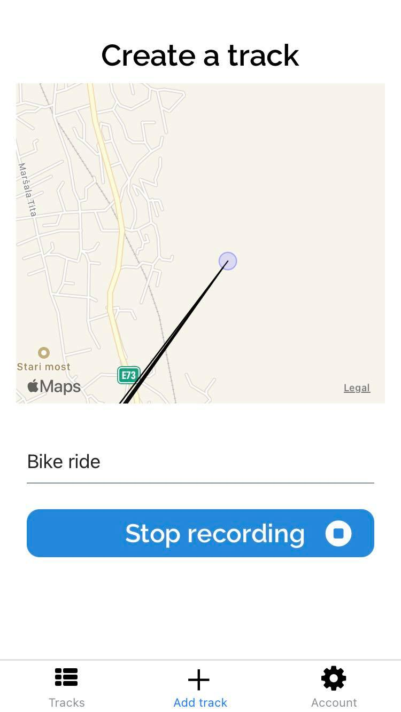  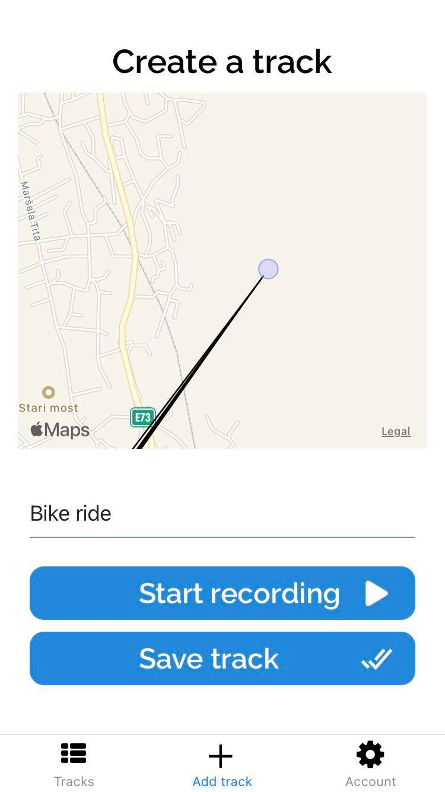  

